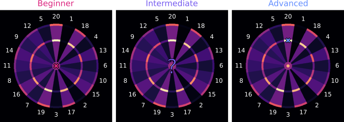
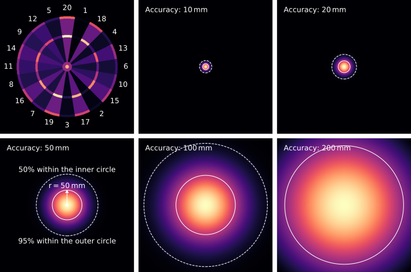
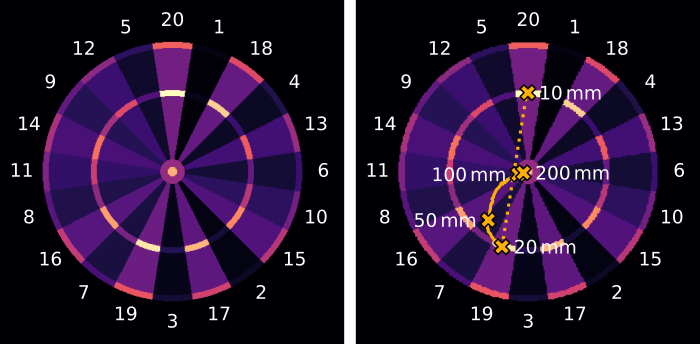
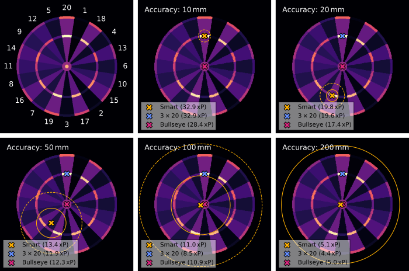
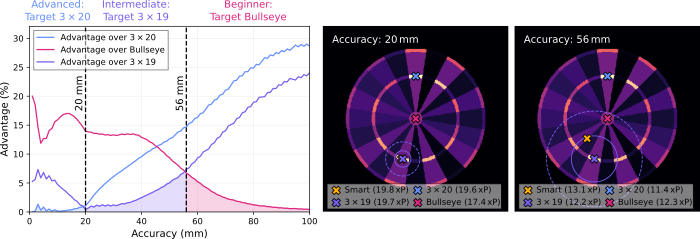

I’m terrible at darts. So much so that I rarely play, missing out on opportunities to improve. Recently, I started wondering if there’s a way to get better at darts without the repetitive grind of constant practice. The short answer is yes — by playing smart. Choosing the right strategy can increase your score by nearly 30% per throw.

In this article, you will see that the usual target of triple 20 is only the best darts strategy if you are an advanced player. Beginners are much better off by aiming for the bullseye. And intermediate players? That’s where it gets interesting. But they too can benefit from a simple and practical strategy. Figure 1 illustrates that your optimal strategy depends on your skill level. So let’s first explore how to determine your skill level.

**Figure 1:** *Beginners in darts should aim for the bullseye. Advanced players who can hit a target accurately will score the most points if they aim for the triple 20. For intermediate players, the best strategy is a little more nuanced.*

The skill of a player is defined by how accurately they can hit a certain point on the dartboard. We measure this accuracy using the radius of a circle in which 50% of the throws land. The smaller the radius, the more accurate the throws, the better the player. Figure 2 shows different throwing accuracies, from 10 to 200 mm, depicted to scale next to a dartboard. The inner circle shows where 50% of the throws land, while the outer circle shows where 95% land. This visualization might help you estimate your personal throwing accuracy.

**Figure 2:** *The dartboard colors correspond to different point values. Brighter colors denote more points. The spread of the point spread functions (PSFs) is illustrated by the radius of the inner circle, showing where half of the darts land. The radius of this circle is the player’s throwing accuracy. The outer circle indicates where 95% of the darts land. All graphics are to scale.*

Below the circles in Figure 2 is the point spread function (PSF). This function illustrates the spread of your throws when aiming at the same point. Mathematically, the PSF quantifies the likelihood of where a throw will land based on your throwing accuracy. Here, we use the PSF to describe the spread in a player’s throws due to limited accuracy. However, the PSF is a crucial mathematical concept used in various scientific disciplines to quantify the spread induced by all types of limitations.

Now that we’ve quantified the throwing accuracy of darts players, we can proceed to establish the optimal strategy for each skill level. Figure 3 reveals that targeting triple 20 is optimal only for advanced players with accuracies of ~20 mm or less. Intermediate players, with accuracies ranging between approximately 20 and 60 mm, require more nuanced strategies. Beginners, whose accuracies exceed 60 mm, should aim for the bullseye. But how did we come to this conclusion?

Intuitively, these results become clear when examining the fields next to the targeted spots. The triple 20 is neighbored by fields 1 and 5, both with relatively low values. Thus, if you miss the triple 20, you’re likely to hit a very low-value field. On the other hand, the triple 19 is neighbored by the higher-valued fields 3 and 7, making it a better choice if your throws occasionally stray to neighboring areas. For beginners who may miss the board at times, targeting the central bullseye maximizes their chances of hitting the board.

**Figure 3:** *The optimal strategy depends on your throwing accuracy. The yellow crosses represent optimal targets for the throwing accuracies depicted next to them. The solid yellow line indicates the evolution of intermediate throwing accuracies. The dotted line marks the jump from triple 20 to triple 19 at ~20 mm accuracy. Therefore, aiming for triple 20 is the best strategy up to throwing accuracies of ~20 mm. Beyond ~60 mm, aiming near the bullseye is preferable. Between roughly 20 and 60 mm the optimal strategy becomes nuanced.*

However, the optimal targets depicted in Figure 3 do not result from intuition but from calculations. To mathematically determine an optimal strategy, we need a quantitative objective: Maximizing the expected points (xPs) per throw. Figure 4 shows the xPs for different accuracies when (i) playing smart to maximize the xPs, (ii) targeting triple 20, and (iii) targeting the bullseye. It is obvious that especially intermediate players (accuracies of ~50 mm) can benefit from deviating from the triple 20 or bullseye strategy.

**Figure 4:** *Optimal targets and expected points (xPs) for different throwing accuracies and strategies. Using the optimal “smart” strategy maximizes the xPs but is complex and consequently impractical to remember. The circles indicate where 50% (solid circle) and 95% (dashed circle) of the darts would land at that throwing accuracy.*

Without getting lost in mathematical details, the xPs of each point on the dartboard are determined by a [convolution](https://medium.com/@bdhuma/6-basic-things-to-know-about-convolution-daef5e1bc411) of the point distribution on the dartboard with the player’s PSF. By calculating this convolution for different throwing accuracies (different PSFs), we generate the blurred dartboard images in Figure 5, which show the xPs depending on the player’s target point. Brighter colors indicate higher xPs at those points. The yellow markers highlight the spot with the maximum xPs corresponding to the optimal “smart” targets shown in Figures 3 and 4.

**Figure 5:** *Expected points (xPs) map for different throwing accuracies. The yellow cross indicates the position of the maximum xP. The blue and red crosses indicate the triple 20 and bullseye, respectively.*

Okay, so the last paragraphs were quite technical and it seems that particularly intermediate players need to apply a pretty complicated strategy. But isn’t there an easy takeaway message with a practical strategy for every skill level? Yes, there is:

- Beginners who miss the board more than once every 100 throws should aim at the bullseye.
- Intermediate players who mostly hit the targeted field or its direct neighbors should aim at the triple 19.
- Advanced players who hit the targeted field more than half the time should aim at the triple 20.

The validity of these three practical strategies is illustrated in Figure 6. The figure shows the relative advantage in xPs gained by using the optimal “smart” strategy compared to the more practical triple 20, triple 19, and bullseye strategies

Advantage = (Smart xP - xP) / xP.

It highlights that correctly choosing one of the latter three strategies limits the advantage of the optimal strategy to well below 10%. However, it also reveals that beginners who aim for the triple 20 instead of the bullseye can underperform by almost 30%. This emphasizes the importance of playing according to your skill level.

**Figure 6:** *Precisely following the optimal “smart” strategy can be rather impractical. It is more practical to use the triple 20, triple 19, and bullseye strategies for advanced, intermediate, and beginner players, respectively. This limits the advantage of the optimal strategy to less than 10%. For players with accuracies beyond 20 mm or 56 mm, the strategies should be switched from aiming at triple 20 to triple 19 or from aiming at triple 19 to the bullseye, respectively. The circles indicate where 50% (solid circle) and 95% (dashed circle) of the darts would land at that throwing accuracy.*

This article has demonstrated that optimizing xPs per throw enables the derivation of three practical strategies. There are certainly many other interesting aspects to consider to find even better dart strategies.

On the one hand, we have assumed that the darts spread out in a circle around a target point. In reality, however, the spread is probably greater either in the horizontal or vertical direction. You can see how this affects the optimal dart strategy in my [follow-up article](../darts-for-smarties-2/). On the other hand, to win the game, the objective needs to shift from maximizing the xPs per throw to hitting exactly the points you have left on your score sheet.

Do you have any additional ideas to explore to find the perfect dart strategy? Feel free to share your thoughts! Let me know how you liked the article and if anything was left unclear. You can find the full Python code [here](https://github.com/edizh/single_darts_1).

While working on this article, I came across many others that cover the topic. I encourage you to explore them for additional perspectives on dart strategies. [[1]](https://arxiv.org/html/2403.20060v1)[[2]](https://www.ttested.com/guide-to-darts/)[[3]](https://medium.com/@alfredcarpenter/mathematically-improving-your-darts-average-4c76c6f3ae56)[[4]](http://www.datagenetics.com/blog/january12012/index.html)

---