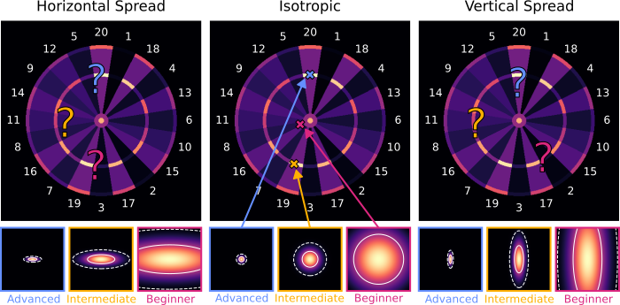
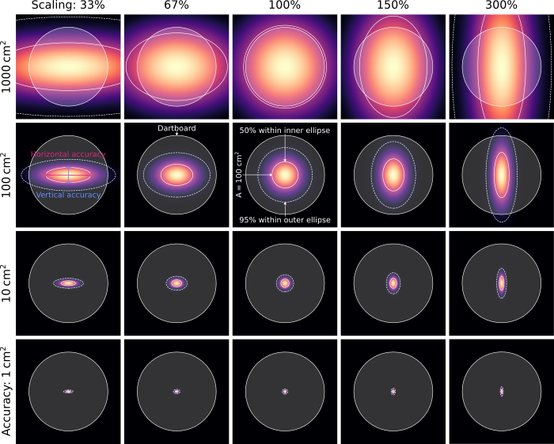
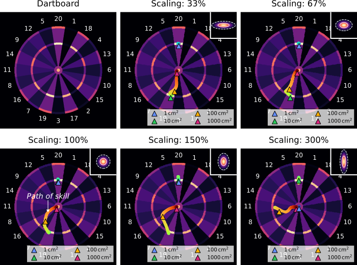
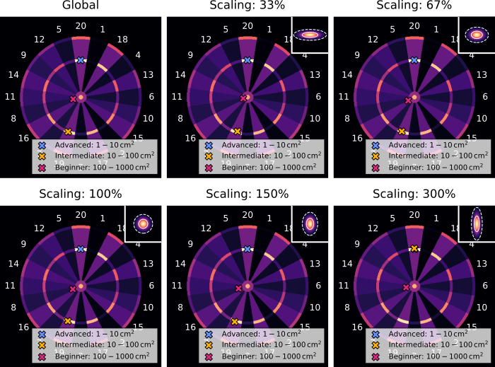

[In my last article](http://localhost:4321/blog/darts-for-smarties-1), I discussed the best dart strategies for beginner, intermediate, and advanced players. If you haven’t read it yet, I recommend you read it to get a solid foundation on this topic. To recap briefly: Beginners should aim for the bullseye, intermediates for triple 19, and advanced players for triple 20 to maximize the expected points per throw. However, there’s a crucial limitation we need to address.

We assumed an isotropic spread in our throws — equal in both horizontal and vertical directions. [In reality](https://www.researchgate.net/profile/Hermann-Mueller-3/publication/228118118_Functional_variability_and_an_equifinal_path_of_movement_during_targeted_throwing/links/554893b20cf2b0cf7aced322/Functional-variability-and-an-equifinal-path-of-movement-during-targeted-throwing.pdf), the spread is greater in one direction. This issue is illustrated in Figure 2 and raises questions about the validity of our previous findings. In this article, we’ll explore how to account for vertical and horizontal spread and its impact on optimal dart strategies. The results are surprising and beneficial, even if you’re unsure about your exact throwing distribution.

**Figure 1:** *[Previously](http://localhost:4321/blog/darts-for-smarties-1), we explored optimal aiming strategies for advanced, intermediate, and beginner players to maximize their points per throw. However, most players do not have isotropic accuracy — equal in both horizontal and vertical directions. This raises the question: how do optimal strategies shift with differing horizontal and vertical accuracies?*

We learned in the [previous article](http://localhost:4321/blog/darts-for-smarties-1) that a player’s skill can be described by a point spread function (PSF). This function describes the spread in your throws given that you aim at a point on the board. We quantified the spread through a radius of a circle within which 50% of your throws land and summarized: the smaller the radius, the more accurate the throws, the better the player.

Unfortunately, as illustrated in Figure 2, we can’t define such a circle anymore if we have different accuracies in horizontal and vertical directions. In this case, we can define the accuracy in terms of the area within which 50% of the throws land and distinguish skill levels according to that area:

- Advanced accuracy: 1–10 cm²
- Intermediate accuracy: 10–100 cm²
- Beginner accuracy: 100–1000 cm²

The different accuracies in horizontal and vertical directions are considered with a scaling factor

Vertical Accuracy = Scaling Factor • Horizontal Accuracy.

Consequently, the isotropic case described in the [previous article](https://medium.com/@edizherkert/darts-for-smart-ie-s-bb4cab288b15) corresponds to a scaling factor of 100%.

**Figure 2:** *The point spread functions (PSFs) for different accuracies and scaling factors. The accuracy is defined by the area where 50% of the darts hit the dartboard (inner ellipses). The outer ellipses indicate where 95% of the darts hit the dartboard. The shaded area outlines the size of the dartboard.*

Since we now have a neat way to describe the skill and uneven spread by the accuracy and scaling factor, we can calculate the highest expected points (xPs) for different parameter combinations. Figure 3 shows the points that maximize xPs for various skill levels and scaling factors. The colors of these _paths of skill_ represent accuracy _,_ ranging from blue to green to yellow to red, indicating decreasing throwing accuracy (1–1000 cm²). The four triangular markers highlight the optimal target points for accuracies of 1 cm², 10 cm², 100 cm², and 1000 cm².

**Figure 3:** *Optimal targets for different scaling factors and accuracies. The colored “paths of skill” indicate the locations that maximize the expected points (xPs). Their colors represent accuracy _,_ ranging from blue to green to yellow to red, indicating decreasing throwing accuracy (1–1000 cm²). The triangular markers point at the optimal targets for accuracies of 1 cm², 10 cm², 100 cm², and 1000 cm². The insets in the upper right depict the shapes of the respective PSFs and are not drawn to scale.*

We see from Figure 3 that the _paths of skill_ are crossing the triple 20, triple 19, and bullseye for most scaling factors. Notably, at scaling factors below 100%, players should shift from targeting the triple 20 to the triple 19 earlier. This early shift occurs because the wider horizontal dispersion makes the values of neighboring fields significant even at good accuracies.

The most significant changes are observed at a scaling factor of 300%. Here, at very good accuracies (1 cm²) aiming at the bullseye is favored, while the triple 19 is consistently suboptimal. This is attributed to the higher likelihood of landing within a single field (e.g. single, double, or triple 20), reducing the relevance of neighboring fields and making the triple 20 more preferable than the triple 19.

Likewise, the other _paths of skill_ can be understood by comparing the shape and size of the PSF with the score distribution on the dartboard. But how can we derive practical strategies from these rather complex and detailed findings? The need to factor in both accuracy and scaling factors makes applying these insights seem impractical. However, there is a surprisingly simple way to obtain viable strategies.

**Figure 4:** *Optimal targets for beginner, intermediate, and advanced players across various scaling factors. These targets are determined by maximizing the average expected points (xPs) of the three respective accuracy regimes (1–10 cm², 10–100 cm², and 100–1000 cm²). The global scenario averages over all scaling factors. The insets in the upper right depict the shapes of the respective PSFs and are not drawn to scale.*

Figure 4 illustrates the optimal strategies based on skill level for six scenarios:

1. Averaged over all scaling factors, if you have no idea if your spread is isotropically, horizontally, or vertically spread (global).
2. For strong horizontal spread (33%).
3. For moderate horizontal spread (67%).
4. For isotropic spread (100%).
5. For moderate vertical spread (150%).
6. For strong vertical spread (300%).

The crosses in Figure 4 indicate positions that maximize average xPs across three accuracy regimes (1–10 cm², 10–100 cm², and 100–1000 cm²). Surprisingly, despite the significant differences in the _paths of skill_, the optimal strategies remain the same for scenarios 1–5:

- **Advanced players** (1–10 cm²) should aim at the triple 20.
- **Intermediates** (10–100 cm²) should aim at the triple 19.
- **Beginners** (100–1000 cm²) should aim just to the left of the bullseye.

Only at strong vertical spreads (300%), intermediate players should aim at the triple 20. However, it is debatable how realistic such strong horizontal/vertical spreads are. Therefore, it is reasonable to conclude that the triple 20, triple 19, and bullseye strategies outlined above are optimal for the vast majority of players.

In this series of articles, we have explored how optimal darts strategies can be derived mathematically for players with different throwing accuracies and isotropic, horizontal, or vertical spread. Interestingly, our conclusions remained the same: triple 20 for advanced players, triple 19 for intermediate players, and bullseye for beginners. What else could we consider in our mathematical darts model to better describe the game? Let me know! You can find the full Python code [here](https://github.com/edizh/single_darts_2).

While working on this article, I came across many others that cover the topic. I encourage you to explore them for additional perspectives on dart strategies. [[1]](https://arxiv.org/html/2403.20060v1)[[2]](https://www.ttested.com/guide-to-darts/)[[3]](https://medium.com/@alfredcarpenter/mathematically-improving-your-darts-average-4c76c6f3ae56)[[4]](http://www.datagenetics.com/blog/january12012/index.html)

---