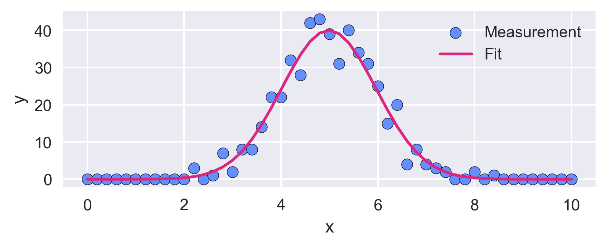
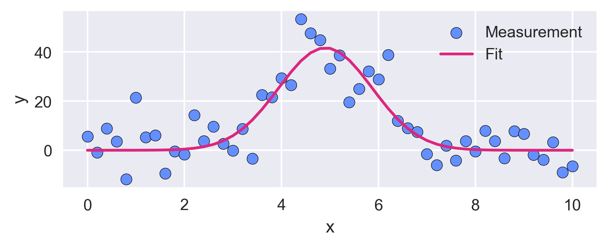
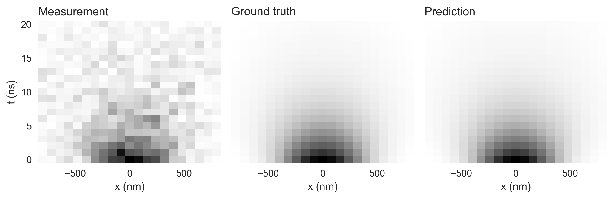
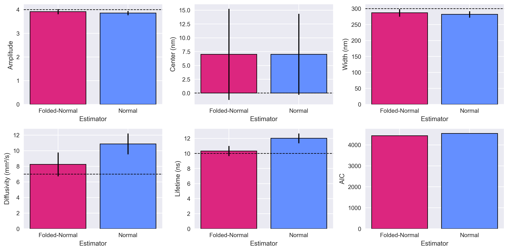
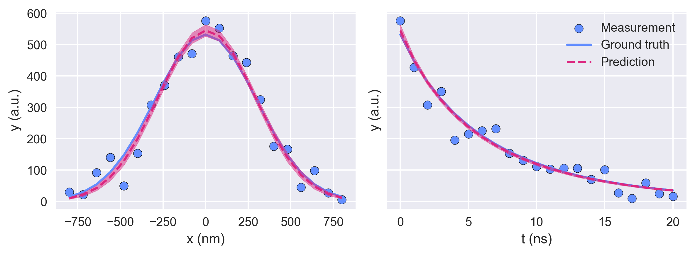

The least squares method is a well-known method for estimating model parameters from data. What is perhaps less well known is that it only provides optimal results if the noise in the data follows a normal (Gaussian) distribution. While this assumption often works well, there are cases where other types of noise dominate the data. In these cases, the least squares method leads to inaccurate parameter estimates.

Recently, I was faced with the task of estimating model parameters from data that was dominated by Poisson noise. Surprisingly, I couldn’t find a Python curve fitting library that provides optimal parameter estimates for different noise models and works out of the box. It seemed that they either required manually writing the correct objective function [[1]](https://www.statsmodels.org/0.6.1/examples/notebooks/generated/generic_mle.html) [[2]](https://scikit-hep.org/iminuit/), were limited to only normal noise [[3]](https://lmfit.github.io/lmfit-py/) [[4]](https://docs.scipy.org/doc/scipy/reference/generated/scipy.optimize.curve_fit.html), or to normal and Poisson noise [[5]](https://etpwww.etp.kit.edu/~quast/kafe2/htmldoc/) [[6]](https://bumps.readthedocs.io/en/latest/tutorial/curvefit/poisson.html).

In practice, none of these libraries offered me the simplicity and convenience of `scipy.optimize.curve_fit(…)` while still providing optimal parameter and uncertainty estimates for non-normal noise. This gap inspired me to write [Emely](https://github.com/edizh/emely), a user-friendly curve-fitting library based on **maximum likelihood estimation (MLE)** that works across a range of noise distributions.

Here, I want to make it easier for you to get started with [Emely](https://github.com/edizh/emely) by demonstrating how to use it in different examples as I encounter them in my daily work. These examples cover the two main ways of using [Emely](https://github.com/edizh/emely).

First, the `emely.curve_fit(…)` method, which mirrors the interface of `scipy.optimize.curve_fit(…)`:

```python
p_opt, p_cov = curve_fit(
    model,
    x_data,
    y_data,
    p0=p0,
    bounds=bounds,
    noise="poisson",  # "normal", "poisson", "laplace", "folded-normal", "rayleigh", "rice"
)
```

Second, the `NormalMLE`, `PoissonMLE`, …, objects that provide a more modern and capable curve fitting interface:

```python
# NormalMLE, PoissonMLE, LaplaceMLE, FoldedNormalMLE, RayleighMLE, RiceMLE
estimator = PoissonMLE(model)
params, param_covs = estimator.fit(
    x_data,
    y_data,
    params_init=params_init,
    param_bounds=param_bounds,
)
```

You can find all examples in the `/examples` folder of the [GitHub repository](https://github.com/edizh/emely). This article refers to the version tag v0.2.2 of [Emely](https://github.com/edizh/emely).

## Installing Emely

Installing [Emely](https://github.com/edizh/emely) should be fairly straightforward. Simply download the [GitHub repository](https://github.com/edizh/emely) with tag v0.2.2 and then run `pip install .` in the folder containing the `pyproject.toml` file. Now you should be able to import [Emely](https://github.com/edizh/emely) from anywhere on your system.

## Example 1: Fitting a 1D signal with Poisson noise

Here, I’d like to walk through a simple example of using `emely.curve_fit(…)` to fit a Gaussian model to data with Poisson noise.

First, let’s import the modules we need:

```python
import numpy as np
import matplotlib.pyplot as plt
from scipy.stats import poisson

from emely import curve_fit
```

Good visuals make explanations easier, so let’s define some colors and plot styles (this is optional, of course):

```python
# define plot style
blue = "#648fff"
yellow = "#ffb000"
red = "#dc267f"
black = "#000000"
plt.style.use("seaborn-v0_8")
plt.rcParams["figure.dpi"] = 300
```

Initializing a random number generator ensures that the results are reproducible:

```python
# initialize the random number generator
rng = np.random.default_rng(42)
```

Next, we define the model we want to fit. Just like with `scipy.optimize.curve_fit(…)`, the function must take the independent variable `x` first, followed by the model parameters `a`, `mu`, and `sigma`:

```python
# define the model
def gaussian(x, a, mu, sigma):
    return a / np.sqrt(2 * np.pi * sigma**2) * np.exp(-((x - mu) ** 2) / (2 * sigma**2))
```

In mathematical form, this Gaussian model is

$$
f(x) = \frac{a}{\sqrt{2\pi\sigma^2}} \exp\left(-\frac{(x-\mu)^2}{2\sigma^2}\right).
$$

Now we can create some synthetic data by evaluating the Gaussian model with parameters `p` and adding Poisson noise, as is common in photon-counting experiments:

```python
# create the Gaussian data with Poisson noise
p = (100, 5, 1)
x_data = np.linspace(0, 10, 51)
y_data = poisson.rvs(gaussian(x_data, *p), random_state=rng)
```

Finally, we fit our data using `emely.curve_fit(…)`. We provide the model function `gaussian`, the data `x_data` and `y_data`, the initial parameters `p0`, and a noise type via the `noise` argument. The usage is identical to `scipy.optimize.curve_fit(…)`, with the single addition of the `noise` argument, which lets us choose the correct noise model:

```python
# fit using MLE for Poisson noise
p0 = (50, 10, 5)
p_opt, p_cov = curve_fit(
    gaussian,
    x_data,
    y_data,
    p0=p0,
    noise="poisson",
)

# print results
p_err = np.sqrt(np.diag(p_cov))
for name, val, err in zip(["a", "μ", "σ"], p_opt, p_err):
    print(f"{name} = {val:.4g} +/- {err:.2g}")
```

The parameter and error estimates returned by the fit are $a = 98.2 \pm 4.4$, $\mu = 4.989 \pm 0.044$, $\sigma = 0.9793 \pm 0.031$, which is fairly close to our actual model parameters `p`. That’s great! We can finish our analysis by plotting the fitted model and our measured data:

```python
# show the fit
plt.figure(figsize=(6, 2))

plt.scatter(x_data, y_data, label="Measurement", edgecolor=black, facecolor=blue)
plt.plot(x_data, gaussian(x_data, *p_opt), label="Fit", color=red)

plt.xlabel("x")
plt.ylabel("y")
plt.legend()
```


**Figure 1:** *The red fitted Gaussian curve closely follows the blue measured data, which is dominated by Poisson noise.*

The plot shows that the fitted Gaussian model closely follows the measured data, demonstrating that `emely.curve_fit(…)` handles Poisson noise effectively.

## Example 2: Fitting a 1D signal with Laplace noise without initial parameters

One advantage of `emely.curve_fit(…)` over `scipy.optimize.curve_fit(…)` is its ability to perform curve fitting without requiring initial parameter guesses. This means that you only need to provide parameter bounds. [Emely](https://github.com/edizh/emely) does this by first running a global stochastic search to find good initial parameters, and then refining them using gradient-based optimization.

The following example shows how this works for a 1D Gaussian signal dominated by Laplace noise. To keep things concise, only the relevant code blocks are shown, since the other code blocks remain unchanged. The full example can be found in the [GitHub repository](https://github.com/edizh/emely).

We begin by creating our data, this time adding Laplace noise:

```python
from scipy.stats import laplace

# create the Gaussian data with Laplace noise
p = (100, 5, 1)
sigma_noise = 10
x_data = np.linspace(0, 10, 51)
y_data = laplace.rvs(
    loc=gaussian(x_data, *p), scale=sigma_noise / np.sqrt(2), random_state=rng
)
```

Next, we can specify the lower and upper bounds for our parameter search. Notice that these bounds can be fairly loose. This means that they do not need to be close to the true parameter values:

```python
# fit using MLE for Laplace noise
bounds = ((1e-15, -100, 1e-15), (1000, 100, 10))
p_opt, p_cov = curve_fit(
    gaussian,
    x_data,
    y_data,
    bounds=bounds,
    sigma=sigma_noise,
    absolute_sigma=True,
    noise="laplace",
)
# print results
p_err = np.sqrt(np.diag(p_cov))
for name, val, err in zip(["a", "μ", "σ"], p_opt, p_err):
    print(f"{name} = {val:.4g} +/- {err:.2g}")
```

The estimated parameters and errors are $a = 100.9 \pm 7.2$, $\mu = 4.908 \pm 0.079$, $\sigma = 0.9651 \pm 0.079$, which are, again, close to the true model parameters.

Here, the argument `sigma` of `emely.curve_fit(…)` specifies the uncertainty (standard deviation) of each y-data point. Setting `absolute_sigma=True` tells [Emely](https://github.com/edizh/emely) that these are absolute uncertainties. If only relative or no uncertainties were known, you would instead use `absolute_sigma=False`, in which case the absolute uncertainties are estimated from the data. Generally, you don’t need to specify uncertainties, as the default is `absolute_sigma=False`. This behaviour is also equal to `scipy.optimize.curve_fit(…)`.

Finally, we can plot the measurement and the fit, just as before, to visually confirm that the curve closely follows the data and that the estimated parameters effectively describe the underlying signal.


**Figure 2:** *Even when only specifying parameter bounds, the red fitted Gaussian curve closely follows the blue measured data, which is dominated by Laplace noise.*

## Example 3: Fitting a 2D signal with folded-normal noise

Just like `scipy.optimize.curve_fit(…)`, `emely.curve_fit(…)` can handle $n$-dimensional signals by passing an $n \times m$ array as the x-data and a length-$m$ array as the y-data. However, this example demonstrates how to use the more flexible object-oriented interface that [Emely](https://github.com/edizh/emely) provides for curve fitting. We limit ourselves to the most relevant code blocks but the full Jupyter Notebook can be found in the [GitHub repository](https://github.com/edizh/emely).

This time, our signal is described by a Gaussian curve that broadens and decays over time:

```python
# define the model
def dynamic_gaussian(u, a, mu, sigma_0, D, tau):
    x, t = u
    sigma = np.sqrt(sigma_0**2 + 2 * D * t)
    return (
        a
        / np.sqrt(2 * np.pi * sigma**2)
        * np.exp(-((x - mu) ** 2) / (2 * sigma**2))
        * np.exp(-t / tau)
    )
```

Equivalently, with $\sigma(t) = \sqrt{\sigma_0^2 + 2Dt}$,

$$
f(x,t) = \frac{a}{\sqrt{2\pi\sigma(t)^2}} \exp\left(-\frac{(x-\mu)^2}{2\sigma(t)^2}\right) e^{-t/\tau}.
$$

The exact meaning of the parameters isn’t important if you’re not familiar with this type of model. What matters here is that we combine the spatial and temporal variables into a single variable `u = (x, t)`. This is simply a convenient way to package all inputs together, since, just like SciPy’s curve-fitting method, [Emely](https://github.com/edizh/emely) expects all independent variables to be passed as a single argument.

Now we can create our synthetic dataset by building a 2D spatiotemporal grid and storing it as a flattened array in our helper variable `u_data`. This time, we add folded-normal noise to the data, which appears when taking the absolute value of a measurement with normal noise.

```python
from scipy.stats import foldnorm
from emely import FoldedNormalMLE, NormalMLE

# create the Gaussian data with folded-normal noise
params_true = (4e-4, 0, 300e-9, 7e-6, 10e-9)
sigma_noise = 50
n_x = 21
n_t = 21
x_data = np.linspace(-0.8e-6, 0.8e-6, n_x)
t_data = np.linspace(0, 2e-8, n_t)
x_data, t_data = np.meshgrid(x_data, t_data)
f_x_t = dynamic_gaussian((x_data, t_data), *params_true)
u_data = (x_data.ravel(), t_data.ravel())
y_data = foldnorm.rvs(c=f_x_t / sigma_noise, scale=sigma_noise, loc=0, random_state=rng)
```

The parameter `c = f_x_t / sigma_noise` of the folded-normal distribution is defined as the ratio of the mean of the underlying normal distribution (our model values `f_x_t`) to the standard deviation (our noise level `sigma_noise`).

Now, we can specify the parameter bounds and fit our measured data. The fitting can be sped up by providing initial parameters through the `params_init` keyword of the `fit(…)` method.

In this example, we compare the performances of the `NormalMLE` and appropriate `FoldedNormalMLE` estimators. We first use the `fit(…)` method to estimate the parameters `params` and their covariance matrix `param_covs`. Next, we use the `predict(…)` method to compute the predicted values `y_pred` and their covariances `y_cov` for a given input `u`. Finally, we obtain the Akaike Information Criterion (AIC) for the fit.

```python
# fit using MLE for folded-normal noise
param_bounds = ((1e-10, -1e-6, 1e-9, 1e-7, 1e-10), (1, 1e-6, 1e-6, 1e-4, 1e-6))

estimator = {
    "Folded-Normal": FoldedNormalMLE(dynamic_gaussian, verbose=True),
    "Normal": NormalMLE(dynamic_gaussian, verbose=True),
}

params = {}
param_covs = {}
y_pred = {}
y_err = {}
aic = {}

for name in estimator:
    print(f"--- {name} Estimator ---")

    params[name], param_covs[name] = estimator[name].fit(
        u_data, y_data.ravel(), param_bounds=param_bounds
    )
    y_pred[name], y_cov = estimator[name].predict(u_data)
    y_err[name] = np.sqrt(np.diag(y_cov)).reshape(n_t, n_x)
    y_pred[name] = y_pred[name].reshape(n_t, n_x)
    aic[name] = estimator[name].akaike_info

    print()
```

The AIC is a goodness-of-fit metric that remains valid even when the noise is non-normal. The key point is that smaller AICs indicate a higher likelihood that the fitted model and chosen noise distribution are appropriate. Therefore, the AIC is useful to assess which of the provided estimators is most suitable for the given data.

Figure 3 shows the noisy measurement, the noise-free ground truth, and the 2D curve predicted by the `FoldedNormalMLE` estimator. It confirms that the predicted curve aligns well with the ground truth.


**Figure 3:** *The measured data is dominated by folded-normal noise. Despite the relatively strong noise, the ground truth is recovered well through folded-normal MLE without the need for initial parameters.*

The bar charts below compare the estimated model parameters and the AIC for the folded-normal (red) and normal (blue) maximum-likelihood estimators. For key parameters such as the diffusivity `D` and the lifetime `tau`, the folded-normal estimator clearly produces more accurate results. Its AIC is also slightly lower, reconfirming that it is the more appropriate estimator for this dataset.


**Figure 4:** *The folded-normal estimator provides better parameter estimates than the normal estimator for all five model parameters (`a`: amplitude, `mu`: center, `sigma_0`: width, `D`: diffusivity, `tau`: lifetime). Furthermore, the folded-normal estimator has a lower Akaike Information Criterion (AIC), which reconfirms that it is more appropriate for this dataset.*

For transparency, note that the folded-normal estimator may sometimes fail to return parameter covariances. This happens because the folded-normal distribution does not allow certain analytical simplifications and therefore requires extra numerical steps, which can occasionally break down. This is indicated by the class attribute `is_semi_analytical=False`. Estimators with the attribute `is_semi_analytical=True` (e.g. `NormalMLE`, `PoissonMLE`, `LaplaceMLE`, `RayleighMLE`) allow these analytical simplifications and provide more robust covariance estimates.

Finally, the graphs below show the predicted model output along the spatial axis at t = 0 s (left) and along the temporal axis at the spatial center (right). The `predict(…)` method also returns an estimate of the prediction uncertainty (covariance), which helps indicate the range in which the true model is likely to lie. Here, the uncertainties (standard deviations) are indicated by the shaded areas in Figure 5.


**Figure 5:** *The plots show the predicted model output along the spatial axis at t = 0 s (left) and along the temporal axis at the spatial center (right). The shaded areas around the predicted curve indicate the prediction uncertainty (standard deviation).*

Keep in mind that, depending on the noise distribution, the interpretation of this standard deviation can be somewhat ambiguous and should be treated with care.

## Conclusion

The goal of this article was to highlight the simplicity and advantages that the [Emely](https://github.com/edizh/emely) package offers. The examples demonstrate that the syntax is similar to that of `scipy.optimize.curve_fit(…)` and that the parameter and uncertainty estimates are accurate across different noise distributions.

The project is still young, and there is lots of room to grow. Upcoming work will include adding confidence-interval estimates for the parameters and validating parameter estimates against real measurements. If you have feedback, ideas for more noise distributions, or would like to contribute, feel free to reach out.

Finally, I would like to give a big thanks to my colleagues [Dr. Luca Bolzonello](https://www.linkedin.com/in/lucabolzonello/) and [Dr. Sven Bodenstedt](https://www.linkedin.com/in/sven-bodenstedt-755793160/) who taught me many of the concepts and noise distributions used in this project.

---
